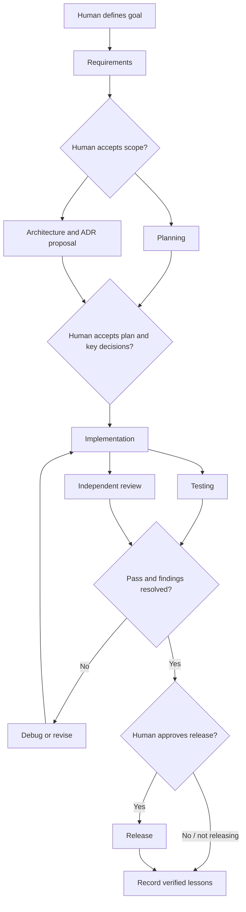

# Phase 1 — Personal AI-Assisted Software Engineering System

**Status:** Design proposal; Phase 2 implementation requires approval

**Scope:** Repository architecture, operating model, and implementation roadmap. This document does not create the system's rules, skills, workflows, templates, agents, or a Flutter application.

## 1. Recommendation

Build a small, technology-aware engineering playbook that is portable across project repositories. Keep the playbook separate from application code. Start with Flutter because it is the current working stack, but organize the common engineering practices so Kotlin, JavaScript/TypeScript, React Native, APIs, and future tools can be added when real projects require them.

Organize material by **what it does**, not by a large numbered list of technologies:

- **Rules** say what should or must be true.
- **Workflows** sequence work and define checkpoints.
- **Skills** describe bounded capabilities an agent can invoke.
- **Agents** define responsibility and handoffs between roles.
- **Guides** explain options and help a human make a decision.
- **Templates** provide reusable starting documents and project seeds.
- **Knowledge** records evidence and lessons from actual work.
- **Career** tracks a small set of professional goals and portfolio evidence.

This keeps one developer able to maintain the system. Do not fill every planned area before a real project needs it.

## 2. Repository architecture

```text
software-engineering-system/
├── README.md
├── AGENTS.md
├── CHANGELOG.md
├── rules/
│   ├── global-principles.md
│   ├── architecture.md
│   ├── coding.md
│   ├── security-and-privacy.md
│   ├── testing.md
│   ├── git-and-review.md
│   └── documentation-and-knowledge.md
├── workflows/
│   ├── project-start.md
│   ├── requirements-and-planning.md
│   ├── architecture-selection.md
│   ├── feature-delivery.md
│   ├── bug-fix-and-debugging.md
│   ├── review-and-testing.md
│   ├── release-and-post-release.md
│   └── project-retrospective.md
├── agents/
│   ├── coordination-model.md
│   └── roles/
│       ├── requirements.md
│       ├── planning.md
│       ├── architecture.md
│       ├── implementation.md
│       ├── testing.md
│       ├── review.md
│       ├── debugging.md
│       ├── documentation.md
│       ├── release.md
│       └── knowledge.md
├── skills/
│   ├── define-requirements/SKILL.md
│   ├── plan-project/SKILL.md
│   ├── select-flutter-state-management/SKILL.md
│   ├── implement-feature/SKILL.md
│   ├── integrate-api/SKILL.md
│   ├── write-and-run-tests/SKILL.md
│   ├── debug-issue/SKILL.md
│   ├── review-changes/SKILL.md
│   └── prepare-release/SKILL.md
├── guides/
│   ├── architecture/
│   │   ├── decision-framework.md
│   │   └── flutter-project-structure.md
│   ├── state-management/
│   │   ├── decision-guide.md
│   │   ├── getx.md
│   │   ├── riverpod.md
│   │   └── bloc-cubit.md
│   ├── api-and-authentication.md
│   ├── testing-strategy.md
│   ├── git-and-release.md
│   └── quality-accessibility-and-observability.md
├── templates/
│   ├── project-brief.md
│   ├── requirements.md
│   ├── project-plan.md
│   ├── feature-specification.md
│   ├── adr.md
│   ├── bug-report.md
│   ├── troubleshooting-report.md
│   ├── code-review.md
│   ├── testing-plan.md
│   ├── release-checklist.md
│   ├── project-completion.md
│   └── project-seed/
├── knowledge/
│   ├── README.md
│   ├── lessons/
│   ├── troubleshooting/
│   │   ├── flutter/
│   │   ├── android/
│   │   ├── ios/
│   │   ├── backend-and-api/
│   │   └── tools-and-dependencies/
│   └── decisions/
└── career/
    ├── roadmap.md
    ├── current-focus.md
    ├── skills-map.md
    └── portfolio.md
```

The tree describes intended homes, not a request to create empty directories or every listed file now. Add a directory when its first useful document is ready. Add `.github/` integrations, scripts, and CI only when there is a demonstrated need.

### Why this structure

The suggested numbered layout separates architecture, state management, testing, and Git into top-level areas. That is easy to scan at first, but it mixes **content type** with **subject area**: architecture rules, architecture tutorials, architecture workflows, and architecture decisions end up far apart or duplicated. The proposed layout keeps each content type in one home and nests only subject-specific reference material under `guides/` and `knowledge/`.

There is no standalone `project-template/` at the root. A reusable starter belongs under `templates/project-seed/`, while project-specific requirements, decisions, and knowledge belong in each app repository. The engineering system itself is not an app repository.

There is no broad top-level `documents/` folder. Explanations and decision references are `guides/`; operational sequences are `workflows/`; past experience is `knowledge/`. This makes placement clearer than a catch-all document directory.

## 3. Purpose and boundaries of each directory

| Location | Purpose | Boundary |
|---|---|---|
| `README.md` | Human entry point and navigation. | Keep short; link to this design and the canonical materials. |
| `AGENTS.md` | Bootstrap instructions for agents working in this repository. | An index and context-loading instruction, not a copy of every rule. |
| `rules/` | Concise, reusable standards and constraints. | No tutorials, lifecycle checklists, or one-project exceptions. |
| `workflows/` | Ordered process, gates, handoffs, and completion conditions. | No duplicated policy; link to rules and skills. |
| `agents/` | Role contracts and the coordination model for future AI-assisted work. | Describes responsibility, not a tool-specific autonomous implementation. |
| `skills/` | Reusable, task-sized procedures for a person or agent. | A skill is not a persona, lifecycle workflow, or technology encyclopedia. |
| `guides/` | Explanations, comparisons, and decision frameworks. | Guidance informs a choice; mandatory expectations live in `rules/`. |
| `templates/` | Blank starting points and the future project seed. | Templates are not completed project records or alternate copies of rules. |
| `knowledge/` | Verified troubleshooting, lessons, and system-wide decisions. | Evidence and history do not automatically become policy. |
| `career/` | Focused goals, skill progress, and portfolio evidence. | Professional development, not a daily diary or private personal archive. |
| `CHANGELOG.md` | Notable changes that affect projects adopting the system. | Do not record every edit; use Git history for that. |

### Keep these concepts distinct

| If the material answers… | Store it in… |
|---|---|
| “What must or should be true?” | `rules/` |
| “In what order do we do the work, and what proves it is done?” | `workflows/` |
| “How do I perform this one kind of task?” | `skills/` |
| “Who owns this decision or output, and who depends on it?” | `agents/` |
| “Why does this approach work, and what are the alternatives?” | `guides/` |
| “What can I copy and fill in?” | `templates/` |
| “What happened in practice, and what did we verify?” | `knowledge/` |

One canonical source should own each rule or procedure. Other files link to it. A workflow can call a skill; a skill can consult a guide and relevant knowledge; an agent role can be assigned a workflow and invoke several skills. These are links between distinct concepts, not reasons to repeat their content.

## 4. Naming and document conventions

- Use lowercase `kebab-case.md` names that describe the topic or task: `feature-delivery.md`, `riverpod.md`.
- Use stable, sequential IDs for decisions: `ADR-0001-feature-first-structure.md`. Do not encode a mutable status in the filename.
- Give each troubleshooting record a symptom-focused name, such as `android-gradle-namespace-error.md`; group by platform or tool under `knowledge/troubleshooting/`.
- Give each skill a folder named for its action, with one entry file named `SKILL.md`. Keep supporting references beside it only when needed.
- Use headings and short sections. A reference document should identify its scope and link to related rules, workflows, and decisions.
- Add status and verified-version metadata where staleness matters, especially for platform runbooks. Do not add maintenance metadata that no one will keep current.
- Use relative links within the repository. Check links during review when files move.
- Cite official upstream documentation for version-sensitive platform behavior and record the version/date checked when the advice can expire.

### Rule format

Rules should be short and testable. Mark each as one of:

- **MUST:** a non-negotiable constraint, such as never committing secrets.
- **DEFAULT:** the standard choice for new projects; a project may override it with a recorded reason.
- **SHOULD:** a strong recommendation that can be skipped when the tradeoff is explained.

Where useful, state the rule, its reason, the permitted exception, and how a person or agent can verify it. Avoid vague rules such as “write clean code.”

## 5. Rule precedence and conflict handling

The system has four scopes, from broad to specific:

```text
Global defaults → Project rules → Feature decisions/specifications → Current task instructions
```

For ordinary choices, the more specific approved scope wins. A project can choose another architecture than the global default; a feature can define its own behavior within the project; a task can specify its acceptance criteria. Project-specific departures from a global **DEFAULT** should record their reason in the project context or an ADR.

Security, privacy, legal, data-loss, and repository safety **MUST** rules are not silently overridden by a lower-level instruction. A human may deliberately revise a policy, but that is a policy decision that should be made explicitly and recorded.

If two applicable sources conflict or it is unclear whether a rule is a default or a must, an agent should stop the affected decision, identify both sources and their scope, explain the practical impact, and ask the human to resolve it. The agent must not silently pick one or rewrite a rule to make its work pass.

## 6. Workflow, skill, guide, template, and knowledge models

### Workflows

Every workflow should define its trigger, inputs, owner, steps, decision gates, expected outputs, completion checks, and recovery path. It should link to the rules and skills used at each step. Workflows are allowed to be lightweight: a small change should not be forced through a full project lifecycle.

The lifecycle is a map, not a waterfall. Requirements and risk shape the plan; architecture is selected only where it matters; implementation, test design, and review can overlap; failures loop back to debugging or implementation; release and post-release work happen only when a project needs them.

### Skills

A skill should have a clear trigger and bounded outcome. Its future `SKILL.md` should state its purpose, inputs/context to inspect, relevant rules and guides, steps, output shape, completion checks, and limitations. Keep one capability per skill. A skill may be reused by multiple agents and projects.

Do not create a separate skill for every framework just to populate the directory. Reference knowledge for GetX, Riverpod, BLoC, Firebase, Docker, or CI/CD belongs in guides until there is a repeatable task that benefits from a dedicated agent procedure. Keep the format mostly tool-neutral; add small adapters if a particular AI platform later requires its own metadata.

### Templates

Templates should prompt for decisions, evidence, and tradeoffs without prescribing the answer. A project seed should include only the minimal project-local context files a new app needs; it should not be a feature-complete Flutter starter before the structure has been validated.

GitHub-specific issue forms and pull-request templates can be added under `.github/` when useful. Keep any platform-specific forms as thin input adapters to the reusable template concepts; do not let them become a second home for engineering policy.

### Knowledge

Knowledge is learned from use, not invented in advance. An entry should separate observation from hypothesis and record enough context to be reusable: stack/tool versions, symptoms, evidence, root cause if known, fix, verification, and prevention. Mark unresolved causes as unresolved.

Create one file per durable issue or lesson. Organize troubleshooting by broad environment or tool, not a deep folder tree for every package. Add indexes only when the collection becomes hard to search. Review old version-sensitive entries when they are reused. Promote a repeated lesson to a rule only after deciding it should apply across projects; keep the original incident as evidence.

## 7. Project start, inheritance, and context loading

### Project inheritance

Use a **versioned snapshot** of the relevant playbook materials in each project, rather than requiring a live network lookup or Git submodule for every agent task.

At project start, the project seed should provide a small local baseline: a concise `AGENTS.md`, a project context/index, the selected global rules and skills needed for that project, and a file that records the source playbook version and paths. Project-specific requirements, technology choices, conventions, ADRs, and knowledge remain in the app repository. They are not written back into the global playbook automatically.

The eventual app-side shape should stay small and recognizable:

```text
app-repository/
├── AGENTS.md
├── engineering-system/
│   ├── VERSION.md          # source URL/tag and copied scope
│   ├── rules/              # selected baseline snapshot
│   └── skills/             # selected task skills, if useful
└── docs/
    ├── project-context.md
    ├── requirements/
    ├── architecture/
    ├── decisions/          # project ADRs
    └── knowledge/          # project-only findings
```

Use project-local Git history to review updates to the copied baseline. Do not put product requirements or project-specific bug records back in the global system unless they have been generalized and reviewed.

This makes each project self-contained and reviewable. It does mean copied rules can age. Updates should be intentional: compare a newer playbook version, review project exceptions, update the selected snapshot, and record the version. Do not introduce a submodule or sync tool until manual copying has become a repeated problem.

### Context hierarchy

```text
Platform/safety constraints
  ↓
Project AGENTS.md and project context index
  ↓
Applicable global-rule snapshot + project rules and accepted ADRs
  ↓
Feature requirements/specification
  ↓
Current task and acceptance criteria
  ↘ load only the relevant workflow, skill, guide, and knowledge entries
```

The final line is selected just in time; an agent should not load every guide or every troubleshooting record. The project index should link to the architecture, active requirements, and current decisions. A task should identify its feature/spec when one exists. Agents should search knowledge by the current platform, tool, error, and version; if no relevant evidence is found, say so rather than claiming the system has no known issue.

### Agent context-loading protocol

1. Read project instructions and identify the requested scope.
2. Read the project's context index, relevant requirements, and applicable accepted decisions.
3. Read only the rules that apply to the change.
4. Select a workflow and one or more bounded skills for the task.
5. Search for knowledge entries matching the observed tools, versions, or symptoms.
6. Report missing context, assumptions, and conflicts before making consequential decisions.

## 8. Architecture and Flutter structure decision framework

Choose architecture by domain complexity, expected change, testability needs, team size, reliability/security risk, and project lifetime—not by lines of code or fashion. The terms describe different dimensions: **feature-based** describes organization; **layered/Clean Architecture** describes dependency boundaries; **MVVM** is a presentation pattern; **repository** and **service** describe responsibilities; **dependency injection** describes how dependencies are supplied. They can be combined selectively and should not be treated as one mutually exclusive menu.

| Project shape | Starting point | Add structure when… |
|---|---|---|
| Small experiment or simple app, few screens, little business logic | Simple feature folders, straightforward state, clear separation of UI from non-trivial logic. Avoid obligatory domain/data layers. | Logic becomes hard to test, several screens share behavior, data sources multiply, or changes repeatedly break unrelated UI. |
| Medium app, several features, APIs and meaningful business rules | Feature-first organization; separate presentation, application/state, and data responsibilities. Add repositories and dependency injection where they isolate change or simplify tests. | Domain rules need independent models/use cases, multiple data sources, offline behavior, multiple contributors, or strong boundaries. |
| Large or production-critical app, complex workflows, multiple contributors, high availability/compliance needs | Explicit dependency boundaries and module ownership; consider Clean/layered architecture, stronger contracts, structured DI, migration/observability plans, and more comprehensive automated tests. | Scale and risk justify the cost; re-evaluate boundaries as actual changes reveal coupling. |

### Eventual Flutter project shape

The future guide should present a starting shape and mark parts as optional, not generate this tree now:

```text
lib/
├── app/                 # composition, routing, app config, theme, DI setup
├── features/<feature>/
│   ├── presentation/    # screens and UI components
│   ├── application/     # state/controller/view-model logic
│   ├── data/            # API/storage adapters and repository implementations
│   └── domain/          # business rules/models when their value is clear
├── shared/              # stable cross-feature UI and utilities
└── infrastructure/      # cross-cutting network/platform integration if needed
test/                    # mirrors meaningful units/features
integration_test/        # end-to-end flows when the app needs them
```

`domain/`, `data/`, and `infrastructure/` are not mandatory in every project. Keep configuration and dependency composition near `app/`; do not store secrets in source. Do not let `shared/`, `services/`, or `core/` become a dumping ground. Promote a component to shared only when multiple features have a real common responsibility. Put tests near the unit or mirror the production structure consistently; choose one convention per project.

Architecture choices that affect long-term cost should be recorded in a project ADR with the alternatives and the reason this level of structure is proportionate.

## 9. Flutter state-management decision framework

Do not choose GetX, Riverpod, or BLoC/Cubit universally. First record the app's state shape, async/data needs, dependency composition, testing expectations, team familiarity, ecosystem constraints, and expected lifetime. Then compare candidates against those needs. A developer's learning goal can be a factor, but it should not outweigh delivery or maintenance needs without saying so.

| Option | Often a reasonable fit when… | Costs and checks to consider |
|---|---|---|
| GetX | A small or medium app benefits from a compact, fast iteration model and the developer understands its reactive conventions. | Keep state and dependencies scoped; watch for implicit/global coupling and mixing state, navigation, and service-locator responsibilities without a reason. Verify test boundaries and upgrade compatibility. |
| Riverpod | Explicit dependency composition, async state, and independently testable providers are valuable across features. | Agree on provider boundaries and lifecycle/disposal practices; account for the learning curve and the exact package/API version. Avoid turning every value into an abstraction. |
| BLoC/Cubit | Explicit state transitions, predictable event flows, or consistent team conventions are priorities. | Choose Cubit vs BLoC by whether explicit events improve the flow; keep event/state modeling proportionate and account for ceremony and boilerplate. |

The guide should include a small decision matrix, not a point score that pretends to make the decision objective. Try to use one main approach per app unless an ADR explains a migration or bounded exception. Record **why this solution fits this project**, what boundaries it owns, alternatives considered, and what new evidence would trigger a review.

## 10. Testing, release testing, and quality model

Use risk-based coverage, not a target percentage divorced from the app. Test high-value behavior and failure paths first. A confirmed production bug should normally add a regression test at the lowest level that reliably catches it.

| Check | Purpose | Future home |
|---|---|---|
| Unit | Isolated business logic, transformations, validators, and state decisions. | Testing guide, feature workflow, test plan. |
| Widget | Rendering, interaction, accessibility semantics, and UI states in a Flutter component. | Testing guide and widget checklist. |
| Integration | Important paths across app layers, plugins, storage, or backend boundaries. | Testing guide and release workflow. |
| API/contract | Request/response, auth, error, and compatibility expectations at the service boundary. | API guide and test plan. |
| Regression | Previously fixed behavior stays fixed. | Bug workflow links issue to test and knowledge. |
| Manual/exploratory | Usability, device/environment variation, and scenarios not cost-effective to automate. | Test matrix and release checklist. |
| Release verification | Install/update, permissions, configuration, critical paths, crash reporting, and rollback/readiness checks for a candidate build. | Release workflow/checklist. |

**Android closed testing and open testing are tester-distribution stages, not test automation levels.** The future release guide should say what each audience is intended to validate, how feedback and crash signals are reviewed, and what evidence is needed to move forward. It should distinguish a limited invited cohort from broader/public access, and verify current Play Console requirements when release instructions are written or used. Use the equivalent platform's current beta/testing mechanism for iOS rather than forcing Android terminology onto it.

The structure should keep test strategy in a guide, test execution and gates in workflows, project-specific cases in app test plans, and blank checklists in templates.

## 11. Git and GitHub strategy

Keep Git proportional to a solo or small project. Start with a protected or carefully maintained `main` branch and small, coherent commits. Use short-lived task branches when a change needs review, collaboration, or isolation; direct commits can remain reasonable for a tiny personal experiment. Avoid a permanent `develop` branch by default.

The future guide should define:

- Branch names that identify work, such as `feat/<short-topic>`, `fix/<short-topic>`, and `docs/<short-topic>`.
- A commit convention such as `type(scope): imperative summary`, with a concise body for non-obvious decisions. Consistency matters more than a commit for every keystroke.
- Pull requests when review, collaboration, or a durable decision record is useful; keep them linked to an issue/spec when one exists.
- A lightweight review checklist for behavior, security, tests, maintainability, and documentation.
- Semantic versions and tags for releases that users or other projects consume; changelog entries for meaningful user-facing/system changes.
- Release branches only when maintaining more than one supported line or preparing concurrent fixes makes them useful.
- Issue/bug tracking with enough reproduction and environment detail to route a bug into the troubleshooting process.

The engineering-system repo should use tags and a changelog once projects start adopting pinned snapshots. Do not introduce a Git-flow process, required pull requests, or elaborate labels just to appear professional.

## 12. Troubleshooting and ADR knowledge models

### Troubleshooting record

Use one record per significant reusable problem, with these fields:

```text
Title / status
Environment and versions
Problem and symptoms
Exact error message or evidence
Possible causes (label hypotheses)
Investigation performed
Root cause (or unresolved)
Solution
Verification
Prevention / detection
Related issues, ADRs, and upstream references
```

Organize by broad domain (`flutter`, `android`, `ios`, `backend-and-api`, `tools-and-dependencies`). Put recurring subtopics such as Gradle, Kotlin, CocoaPods, Xcode signing, Firebase, authentication, navigation, async/null-safety, performance, and memory in searchable record names/tags. Do not create an empty folder for every possible bug category.

### Architecture Decision Records

Use the same ADR template in both places: accepted system-wide choices live in `knowledge/decisions/`; project-specific choices live in that project's own repository. Each ADR should include ID/title, status (`proposed`, `accepted`, `rejected`, `superseded`), date, context, decision drivers, options considered, decision and rationale, consequences/tradeoffs, scope, and review triggers/related ADRs.

An ADR records why, not just what. Do not rewrite history when a decision changes: create a new ADR that supersedes the old one and link them. A state-management choice, architecture level, Git branching exception, or project-specific deviation should have an ADR when its future cost or rationale would be hard to infer from code.

## 13. AI-agent architecture and coordination

Agents are role contracts, not mandatory separate model instances. A single coding agent can take several roles; separate agents are useful only when work can be split without competing edits or inconsistent assumptions. The human remains responsible for priorities, acceptance, and consequential decisions.

| Role | Reads | Owns/produces | Dependencies and gate |
|---|---|---|---|
| Requirements | Project context, idea, user constraints, relevant product/security rules. | Requirements, acceptance criteria, assumptions, open questions. | Human accepts scope before irreversible planning or implementation. |
| Planning | Accepted requirements, project workflow, risks, constraints. | Milestones or task breakdown, dependencies, risk list, completion conditions. | May run with architecture exploration; human resolves scope/time tradeoffs. |
| Architecture | Requirements, project structure guide, architecture/state decision guides, existing ADRs. | Options, recommendation, boundaries, and a proposed ADR. | Human approves material stack, architecture, data, or security decisions. |
| Implementation/Coding | Accepted task, feature spec, project rules, accepted ADRs, relevant skill and knowledge. | Bounded code change, tests, and concise change/evidence summary. | Starts after acceptance criteria and consequential design decisions are clear. |
| Testing | Requirements, risk, test guide, test plan, changed behavior. | Test cases/results, gaps, reproducible failures. | Test design can overlap implementation; final results require a candidate change. |
| Review | Diff, acceptance criteria, rules, ADRs, test evidence. | Prioritized findings with file/behavior evidence; no silent scope changes. | Can run in parallel with independent testing after the change is reviewable. |
| Debugging | Reproduction, logs/errors, environment, recent changes, relevant knowledge. | Evidence-backed hypotheses, root cause when proven, fix and verification plan. | Activated on failure or bug; unresolved uncertainty is reported, not hidden. |
| Documentation | Accepted requirements/decisions and verified implementation. | Updated user/developer docs or a proposal for what is missing. | Runs after content is stable; does not invent behavior from code guesses. |
| Release | Version, change summary, test/review evidence, release guide. | Readiness assessment, artifacts/checklist, rollback or recovery notes. | Human explicitly approves publishing, rollout, or external release actions. |
| Knowledge | Verified incident/fix, environment, test results, related ADR. | Reusable troubleshooting/lesson entry and optional rule-change proposal. | Runs after evidence is verified; may propose policy but cannot promote it automatically. |

### Coordination model



The loop is conditional: a small documentation fix does not need every role. Testing and review can run independently; a failure returns to a bounded fix and both checks rerun as appropriate. Human approval is needed for scope tradeoffs, material architecture/security/data decisions, and publishing or rollout. Agents should not edit the same artifact concurrently; assign one owner per output and have other roles review it. They should cite the requirements, rule, ADR, or evidence behind consequential recommendations and report blockers early.

## 14. Project answer map

These locations make the repository answer the recurring project questions without creating one giant manual:

| Project question | Primary material |
|---|---|
| Before starting; collect requirements; plan | `workflows/project-start.md`, `workflows/requirements-and-planning.md`, related skills and brief/requirements/plan templates. |
| Architecture and project structure | Architecture workflow and `guides/architecture/`; record project choice as an ADR. |
| State management | `guides/state-management/decision-guide.md` plus relevant provider guide; record why in project ADR. |
| Coding, APIs, authentication, errors | Applicable coding/security rules, API guide, feature/API skills, and feature workflow. |
| Git, PR, and review | Git/review rules, guide, review workflow, and review template. |
| Unit/widget/integration/API/regression/manual tests | Testing guide, test workflow, project test plan, and testing skill. |
| Debugging and common platform/package problems | Bug workflow, troubleshooting skill, and searchable `knowledge/troubleshooting/` records. |
| Android/iOS release and Android test cohorts | Release workflow and version-checked platform guide/checklists. |
| Record a bug, decision, lesson, or project completion | Bug/troubleshooting/ADR/retrospective templates; knowledge or project-local destination based on scope. |
| AI context and agent responsibility | Root `AGENTS.md`, `agents/coordination-model.md`, role contracts, and selected skills. |
| Improve after a project | Retrospective workflow, knowledge model, changelog, and explicit review of proposed rule changes. |

## 15. Career-development layer

Keep `career/` limited to professional outcomes:

- `roadmap.md`: long-term move toward professional software engineering and staged milestones.
- `current-focus.md`: a few current priorities and what evidence would show progress; review periodically, not daily.
- `skills-map.md`: skills to learn, current confidence, and evidence/projects demonstrating ability.
- `portfolio.md`: completed projects, responsibilities, decisions, and improvements worth presenting.

Record completed work as portfolio evidence. Put technical lessons in `knowledge/`, not a personal diary. Keep weaknesses actionable and review them through goals. Since the repository may be public, include only career information the owner is comfortable publishing; keep private notes and credentials out of Git.

## 16. README outline (do not expand it into a manual)

The future README should stay a navigable front page with these sections:

1. **What this is:** a personal, reusable engineering playbook and agent context source.
2. **Why it exists / who it is for:** current Flutter work and gradual growth into broader software engineering.
3. **What it is not:** not a Flutter app, universal framework mandate, or autonomous agent platform.
4. **How to navigate:** a short description and links to rules, workflows, agents, skills, guides, templates, knowledge, and career.
5. **Start a project:** point to the project-start workflow and project seed; name the playbook version to adopt.
6. **How an agent uses it:** point to `AGENTS.md` and the context-loading protocol.
7. **Add knowledge or propose a rule:** explain evidence, review, and promotion from lesson to rule.
8. **Evolution and releases:** describe the pilot/review loop, changelog, and versioned snapshots.

The README should not repeat the folder tree in full or explain each technology. Keep details in their canonical guide and link to them.

## 17. Future automation roadmap

Automation should follow repeated manual work and stable conventions:

1. **Manual baseline:** versioned templates, documented project start, and a real project pilot.
2. **Light validation:** check broken links, required metadata, and formatting only after the document conventions settle.
3. **Project initialization:** generate a project context file and copy selected rules/skills from a chosen playbook version.
4. **Quality checks:** add formatting, linting, tests, dependency/security checks, and GitHub CI based on actual language/project needs.
5. **Context selection:** build indexing/loading helpers only if people or agents repeatedly load too much or miss relevant knowledge.
6. **Release and knowledge assistance:** automate release evidence and knowledge entry creation only after humans have established the decisions and review gates.

Do not begin with an agent framework, auto-sync between repositories, a universal multi-language generator, or autonomous release tooling. Those increase maintenance and can spread bad rules faster.

## 18. Phase 2 implementation plan — pending approval

After approval, build a thin, usable baseline in this order:

1. Confirm the architecture and repository display name; keep the README concise and use its agreed outline.
2. Add the root `AGENTS.md` as a short navigation/context-loading entry point and establish the rule format and precedence.
3. Create only the first essential rules: global principles, architecture proportionality, security/privacy, coding, testing, and Git/review.
4. Write the first decision guides: architecture scale, Flutter structure, and GetX/Riverpod/BLoC selection.
5. Add the core workflows: project start and requirements, feature delivery, bug/debug, review/testing, release, and retrospective.
6. Add only the templates required by those workflows: project brief, requirements, plan, ADR, bug/troubleshooting, test/release, and completion.
7. Pilot the baseline on one real Flutter project; capture friction and verified lessons before expanding skills, agent roles, or the project seed.

Phase 2 should not create every proposed file just because it appears in the target tree. The pilot decides what becomes useful next.

## 19. What not to build yet

- Ten autonomous agents or a fixed agent chain.
- A Flutter application, complete boilerplate, or all-platform project generator.
- Separate top-level documentation sets for every language and package before using them.
- Exhaustive GetX/Riverpod/BLoC/Firebase/Supabase/Docker/CI tutorials.
- A large troubleshooting catalogue without verified project incidents.
- Automatic syncing, complex version-management tooling, custom AI infrastructure, or autonomous releases.
- A large README, daily career diary, mandatory Clean Architecture, fixed testing percentage, or enterprise Git Flow for solo work.

## 20. Risks and safeguards

| Risk | Safeguard |
|---|---|
| The scope expands into every language, tool, and platform. | Keep shared foundations small; add a technology guide only when a project needs it. |
| Rules become too strict for different project sizes. | Label MUST/DEFAULT/SHOULD; allow reasoned project overrides for defaults. |
| Copying global material creates stale project snapshots. | Record the source version and update deliberately; automate only after repeated pain. |
| Agents receive too much context or miss a relevant rule. | Use a short index, task-based loading, and specific links; do not inject the entire repository. |
| Agent roles contradict or edit the same files. | One owner per output, shared accepted requirements/ADRs, evidence-backed handoffs, human gates. |
| Knowledge entries become speculation or stale advice. | Separate hypotheses from verified cause, record versions, and review when reused. |
| Guides, rules, workflows, and templates duplicate each other. | Keep a placement test, canonical sources, and links; review duplicates during changes. |
| The architecture is designed without being used. | Pilot a minimum baseline on a real project before expanding the system. |
| Public career documents reveal information unintentionally. | Keep only deliberately public professional information; exclude secrets and private notes. |
| Platform behavior changes after documentation. | Cite official sources and versions; verify Android/iOS store guidance when writing or using release steps. |

## 21. Phase 1 quality review

This design deliberately changes several assumptions in the initial folder proposal:

- Numbered folders are unnecessary; category names and README navigation are more stable than ordering every area.
- Architecture, state management, testing, and Git should not each have separate top-level rule/workflow/skill/knowledge silos; those materials are cross-linked by purpose.
- Agent work is a gated loop with parallel testing/review and conditional debugging, not a mandatory linear relay.
- Closed/open testing describes tester access stages, while unit/widget/integration describe verification scope.
- Feature-first organization, Clean Architecture, MVVM, repositories, services, and dependency injection describe different concerns and should be selected proportionally.
- A project-local snapshot is simpler and more reliable for agents than a live dependency on a separate repository, with an explicit version/update cost.
- Missing cross-cutting concerns worth including are privacy/secrets, accessibility, observability, dependency/platform version evidence, and release recovery. Their depth should follow project risk.

The largest remaining risk is building a documentation system that is more work than the projects it supports. A successful first release is the smallest set of rules, decisions, workflows, and templates that helps one real Flutter project, with a clear path to improve it afterward.

## 22. Final Phase 1 decision

Recommended name in documentation: **Personal AI-Assisted Software Engineering System**. The existing GitHub repository slug can remain `agentworkflow` for now; renaming the remote is a separate decision and is not needed to finish this design.

Build first: the concise entry points, core rules, project-start and feature workflows, architecture/state/testing decision guides, and the small set of templates needed to pilot the system.

Do not build yet: the full language catalog, all agent implementations, exhaustive knowledge entries, project generator, or automation.

Phase 2 begins only after the owner approves this design. The human developer remains the final decision maker throughout.
